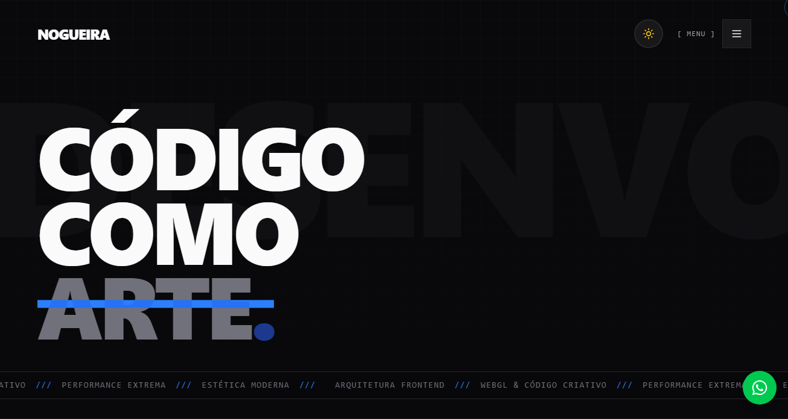

<div align="center">

# Luis Nogueira — Desenvolvedor Web

**Portfólio profissional desenvolvido com React, TypeScript e Framer Motion**

[](https://nogueiraweb.vercel.app)
[](https://www.linkedin.com/in/luis-antonio-dos-santos-nogueira-52980634b)
[](./LICENSE)

[🌐 Ver ao vivo](https://nogueiraweb.vercel.app) · [📩 Entrar em contato](mailto:sn.luisantonio24@gmail.com)

</div>

---

## Sobre o projeto

Portfólio pessoal para apresentar meus projetos, habilidades técnicas e experiência como desenvolvedor web frontend. O foco foi construir uma interface rápida, responsiva e com animações fluidas, priorizando performance e boa experiência do usuário.



---

## Tech stack

| Camada | Tecnologia |
|---|---|
| Framework | React 18 + TypeScript |
| Estilização | Tailwind CSS v4 |
| Animações | Framer Motion (motion) |
| Ícones | Lucide React |
| Build | Vite 6 |
| Deploy | Vercel |

---

## Projetos em destaque

### Oportuna Conecta
Plataforma web de empregabilidade para o mercado industrial. Inclui sistema de matching de vagas, assistente de IA para análise de perfis e avaliação de competências técnicas.

**Stack:** React · TypeScript · Tailwind CSS · shadcn/ui

---

### Amor & Cacau
E-commerce completo para confeitaria artesanal. Catálogo dinâmico, checkout com cálculo de frete por CEP, pagamento via PIX e painel administrativo em tempo real.

**Stack:** React · TypeScript · Supabase

---

## Rodando localmente

Pré-requisito: Node.js 18+

```bash
# Clone o repositório
git clone https://github.com/Santozs2/Portfolio-Nogueira.git
cd Portfolio-Nogueira

# Instale as dependências
npm install

# Inicie o servidor de desenvolvimento
npm run dev
```

O site estará disponível em `http://localhost:5173`.

```bash
# Gerar build de produção
npm run build

# Pré-visualizar o build
npm run preview
```

---

## Estrutura do projeto

```
Portfolio-Nogueira/
├── src/
│   ├── assets/        # Imagens e ícones
│   ├── components/    # Componentes React reutilizáveis
│   └── main.tsx       # Ponto de entrada
├── public/            # Arquivos estáticos
├── index.html
├── tailwind.config.js
├── vite.config.ts
└── package.json
```

---

## Contato

| Canal | Link |
|---|---|
| E-mail | [sn.luisantonio24@gmail.com](mailto:sn.luisantonio24@gmail.com) |
| LinkedIn | [luis-antonio-dos-santos-nogueira](https://www.linkedin.com/in/luis-antonio-dos-santos-nogueira-52980634b) |
| WhatsApp | [+55 17 99196-2290](https://wa.me/5517991962290) |
| Instagram | [@santoz.wdd](https://www.instagram.com/santoz.wdd/) |

---

<div align="center">
  Desenvolvido por <strong>Luis Antonio Nogueira</strong>
</div>